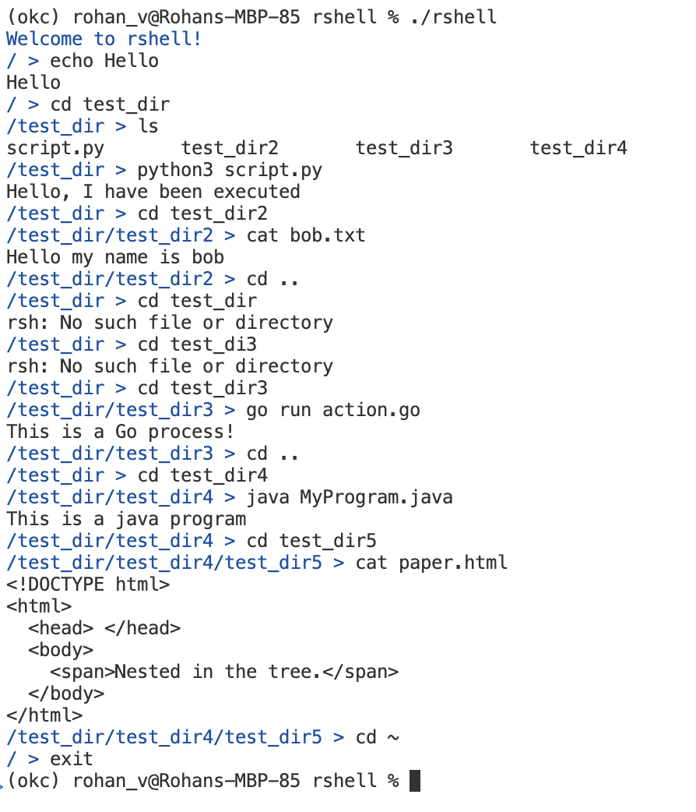

## rshell (Rohan Shell)

This is simple implementation of the UNIX-based shell heavily influenced from:

- [build-your-own-x Shell](https://github.com/codecrafters-io/build-your-own-x?tab=readme-ov-file#build-your-own-shell)
- [Brennan.io - Programming a C Shell](https://brennan.io/2015/01/16/write-a-shell-in-c/)

## Instructions to run

To execute the program run the following executable in the root directory of the project:

```bash
$ ./rshell
```

Upon commencing, you should see a terminal prompt

```sh
Welcome to rshell!
/ >
```

## Implementation Details

The shell process is isolated to the current directory, so you cannot `cd` out of the project's root directory. To accomplish this, the program maintins a directory node link list where the current node references its parent, so that a `cd` reverse can retrieve a path. To run a program, the `rsh_launch` calls `fork()` and runs `execvp(...)` in the child process while the parent process waits for it to finish.


